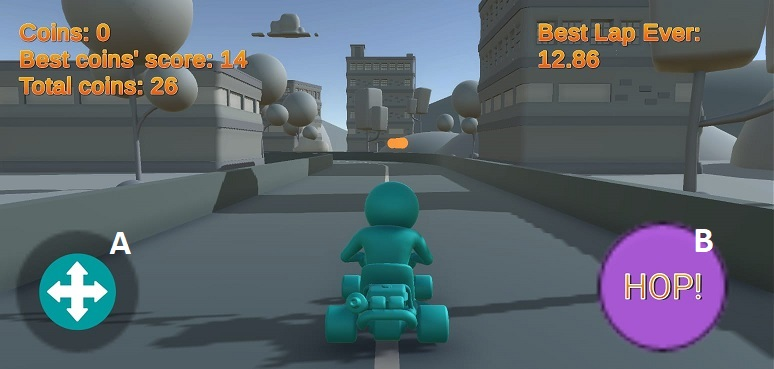

Resumen
=======

En esta prueba de programación se ha modificado el proyecto de aprendizaje Karting Microgame en Unity 3D 2018.4.17a1 incluyendo las siguientes funcionalidades.

-   Inicio del juego con una escena de menú principal con los botones *Play* y *Exit*.

-   Lanzamiento de menú de juego al acabar las tres vueltas de una carrera con resumen de la partida con los botones *Play again* y *Back to main menu*.

-   Menú principal con información de ranking guardada localmente si la hubiera (mejor vuelta histórica, número total de monedas cogidas).

-   Implementación de monedas recogibles en la carrera.

-   Mensaje de aviso cuando se consigue un nuevo record de menor tiempo de vuelta.

-   Implementación de controlador de juego con joystick virtual y botón en pantalla.

Puede encontrarse el código descargable en el siguiente repositorio: <https://github.com/HernanMGC/KartingMicrogameMobile>.

Controles
=========

-   *Joystick* (A) para controlar el *kart*.

-   Pulsar el botón *HOP!* (B) para saltar.

-   Dejar pulsado el botón *HOP!* (B) para derrapar.

MainScene
=========

Para la gestión de escenas se han generado dos nuevas escenas: `Persistent` y `MainScene`.

La escena `Persistent` con tan sólo un `GameObject` con el componente `GameManager.cs` encargado de cargar y descargar escenas aditivamente.

La escena `MainMenu` tiene un componente llamado `Menu.cs` que gestiona un `Canvas` con dos botones: *Play* y *Exit* que se comunican con `GameManager.cs` para cargar la escena de juego, `GameScene`, y descargar el `MainMenu`.

Adicionalmente esta escena muestra información sobre ranking de partidas. Concretamente muestra el mejor tiempo de vuelta hecho hasta el momento y el número total de modendas recogidas entre todas las partidas.

El mejor tiempo se muestra de dos formas distintas en función de su forma de almacenado, una desde `PlayerPrefs` y la otra desde almacenamiento local por fichero.

Dado que la especificación de la prueba decía que había que añadir una funcionalidad de almacenamiento local del valor de mejor tiempo de vuelta y el código base ya lo implementaba a través de guardado por fichero, para esta prueba se ha decidido hacerlo en en fución de `PlayerPrefs`. Otra diferencia respecto a esta implementación es que en este caso el valor, si se consiguiera un *record*, se alamcena en el momento de completar la vuelta, y no al acabar la carrera como el caso del almacenamiento por fichero implementado en el código base.

Para el caso otra por el componente `Coin Display.cs`, que se ha desarrollado tomando `TimeDisplay.cs` como esqueleto. Eso implica que también se ha desarrollado una clase `Serializable` `CoinRecord.cs` similar a `TrackRecord.cs` que almacena la cantidad de monedas recogidas. En el caso de `TrackRecord.cs` mediante la gestión `TrackManager.cs` se almacena dos ficheros localmante, `ArtTest1.dat`, record de vuelta; y `ArtTest3.dat`, record de carrera completa. En el caso de `CoinRecord.cs` se ha modificado `TrackManager.cs` para que se almacenen `ArtTestCoins1.dat`, record de monedas recogidas en una carrera; y `ArtTestCoins3.dat`, total de monedas recogidas en todas las carreras.

MetaGameController
==================

Se ha modificado el componente `MetaGameController.cs` para poder permitir que se lance el menú de la escena de juego con las opciones de jugar de nuevo o volver al menú principal automáticamente al acabar la carrera.

Para ello también se ha modificado el `Prefab` `MainMenuCanvas` para que contega sólo una sección de menú con los botones *Play again* y *Back to main menu*.

MobileInput
===========

Se ha implementado un controlador con *joystick* y botón virtual en pantalla utilizando el paquete `CrossPlatformInput` de `StandardAssets` comunicado con el componente `MobileInput.cs` que toma como esqueleto el presente `GamepadInput.cs`.

Se ha modificado el `Joystick.js` de `CrossPlatformInput` para admitir, además de la imagen del joystick, una imagen de *background* cuya posición se actualizara al cambiarse la orientación de la pantalla, dado que la implementación dentro de `CrossPlatformInput` fuerza una actualización de `transform.position`, descentrando su posición relativa.

Coins
=====

Se ha implemantado un componente `Coin.js` y su respectivo `prefab`. Su implementación se ha basado en la implementación de `Checkpoint.js`, lo que ha implicado modificaciones en `Racer.js` y en en `TrackManager.js`.

El el primer caso para poder añadir funciones de `set` y `get` de la cantidad de monedas que tiene el usuario.

Y en el segundo para gestionar la lista de monedas de la pista, las colisiones con ellas y sus consecuencias respecto a `Racer.js` y al *ranking* de monedas.

Record y mensajes
=================

Se ha aprovechado la implementación de la cuenta atrás para implementar un aviso de *New record!* al acabar una vuelta y superar un record de tiempo de vuelta. Para eso se implementado un nuevo `Timeline` llamado `NewRecord` usando la animación inversa a la aparición de los números de la cuenta atrás y se ha añadido una variable pública a `TrackManager.js` para almacenar una referencia al `PlayableDirector` y poder lanzar esta animación en el momento adecuado.
